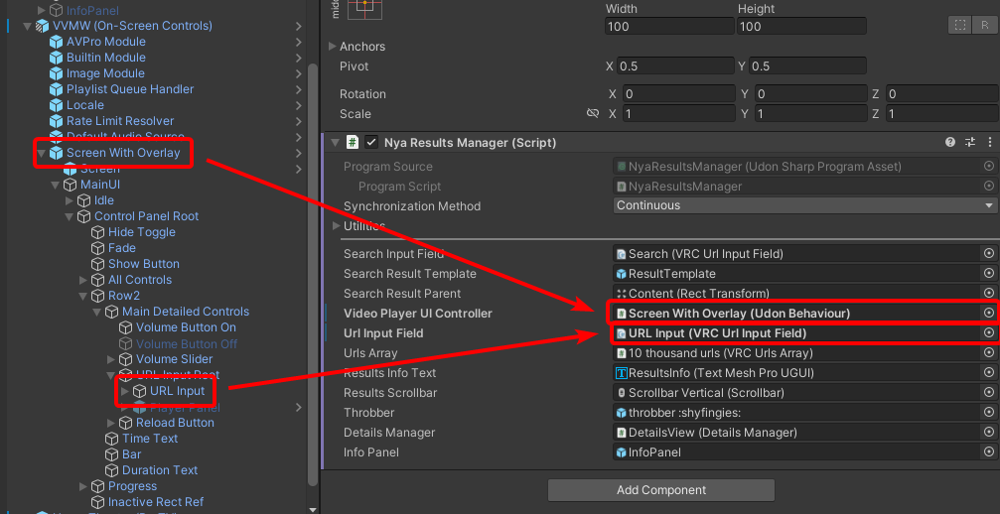
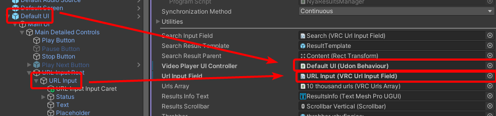
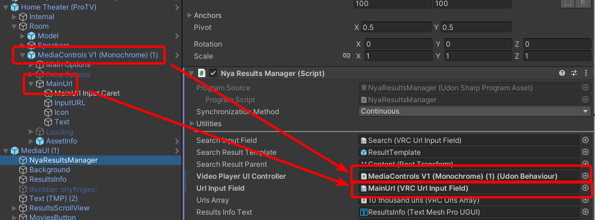
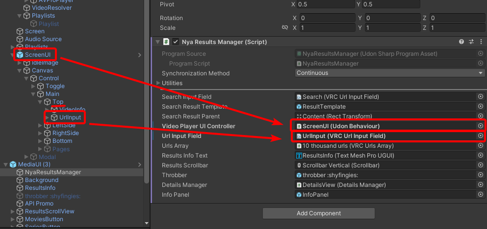
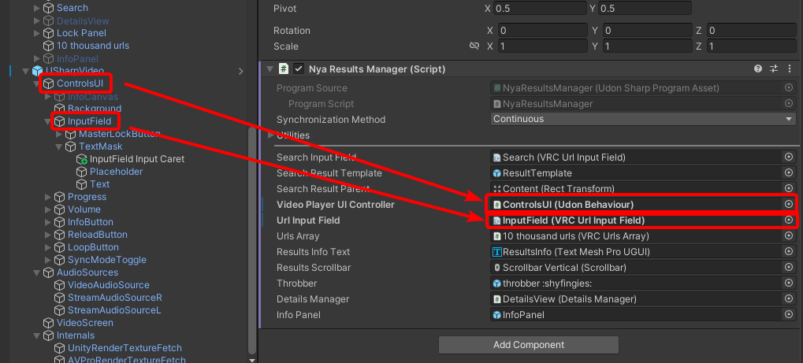

import { FileTree, Tabs, TabItem, Aside } from '@astrojs/starlight/components';

## Prerequisites

A basic understanding of Unity and VRChat world building is assumed. 

You will need:

- A VRChat SDK3 World project on Unity 2022.3.22f1 or later.
- A supported videoplayer prefab (or the ability to modify scripts to add support). 
    - [VizVid](https://github.com/JLChnToZ/VVMW) is recommended.
    - [YAMAPlayer](https://github.com/koorimizuw/YamaPlayer), [ProTV](https://protv.dev/), and USharpVideo are also supported out of the box.

## Download the MediaUI Package

Download the latest version of the MediaUI package (v0.7.0) and import it into Unity ([tutorial](https://youtu.be/ZYJ7idfeuZQ)).

##### [Download Link](/dl/MediaUI%20v0.7.0.unitypackage) 

(A VRChat Package Repository & public repository on GitHub will be available in the future for easier updates and transparency.)

## Setting Up MediaUI in Your VRChat World

Once you have imported the package, you should be able to see the MediaUI folder and prefab.

<FileTree>

- Assets/
  - MediaUI
    - Scripts/
    - UI&nbsp;Assets/
    - **MediaUI.prefab**
  - ...
- Packages/

</FileTree>

Drag and drop the **MediaUI.prefab** into your scene hierarchy and position it however you want.

Open the MediaUI GameObject in the hierarchy and select the **NyaResultsManager** object underneath it.

From here, instructions depend on your chosen videoplayer prefab.

<Tabs>
  <TabItem label="VizVid">
    Drag these two objects from your vidvid prefab into the respective fields in the NyaResultsManager component, as shown in this picture

    

    Depending on your prefab, it can also look more similar to this

    

    If you're unsure which objects to use, the `Video Player UI Controller` object should be the one with the VizVid **UI Handler** script, and the `Url Input Field` should be the one referenced in that script.

  </TabItem>
  <TabItem label="ProTV3">
    Drag these two objects from your ProTV3 prefab into the respective fields in the NyaResultsManager component, as shown in this picture

    

    If you're unsure which objects to use, the `Video Player UI Controller` object should be the one with the ProTV3 **Media Controls** script, and the `Url Input Field` should be the one referenced in that script under `Main Url Input`.

  </TabItem>
  <TabItem label="YAMAPlayer">
    Drag these two objects from your YAMAPlayer prefab into the respective fields in the NyaResultsManager component, as shown in this picture

    

    <Aside type="caution">
    Make sure it's under the **Top** gameobject, not LeftSide, RightSide, or Bottom!
    </Aside>

    If you're unsure which objects to use, the `Video Player UI Controller` object should be the one with the YAMAPlayer **UI Controller** script, and the `Url Input Field` should be the one referenced in that script under `Url Input Field Top`.
  </TabItem>
  <TabItem label="USharpVideo">
    Drag these two objects from your USharpVideo prefab into the respective fields in the NyaResultsManager component, as shown in this picture
    
    

    You will also have to change USharpVideo to only use AVPro as the default video backend, as other backends are not supported by MediaUI. (Switching will be done automatically in future versions.)

    If you're unsure which objects to use, the `Video Player UI Controller` object should be the one with the USharpVideo **Video Control Handler** script, and the `Url Input Field` should be the one referenced in that script under `Url Field`.
  </TabItem>
  <TabItem label="ProTV2">
    This prefab is supported, but docs have not been written. It *should* be similar to the ProTV3 setup.
  </TabItem>

</Tabs>

## Done!

You should now be able to build and test your world and play media from any of the [supported APIs](/apis) using MediaUI!

You can scale, rotate, and position the MediaUI prefab as needed to fit your world design. Keep in mind scales drastically different than the default may cause issues.

If you run into any issues, feel free to join our [Discord](https://discord.gg/KcU9BnEKEK) for help.